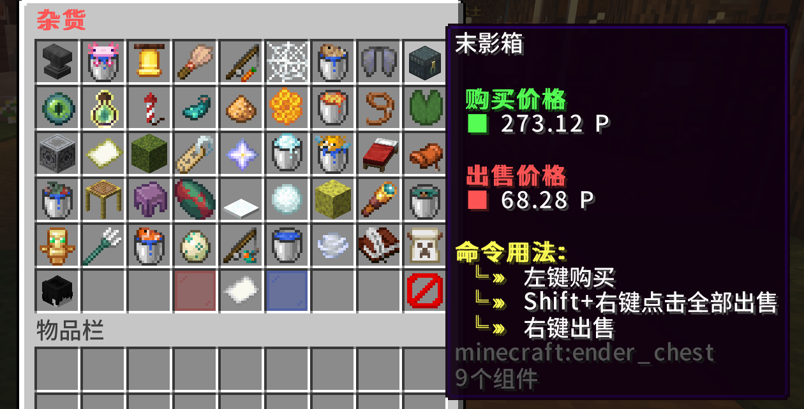
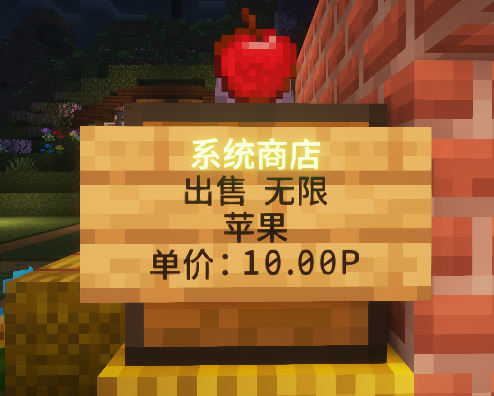

# 经济

服务器提供了多种经济交易方式，用于构建开放的经济体系。

使用指令 /bal 查看喵币

## 系统商店

系统商店可以直接在系统菜单中打开，系统商店支持购买与收购，几乎能够购买游戏内的任何道具。

## 箱子商店

箱子商店属于实体商店，玩家可以利用箱子商店来建造属于自己的商店。

- 创建箱子商店：将需要出售或收购的物品手持，然后点击箱子，在聊天栏输入需求出售/收购的价格，这样一个箱子商店就创建成功了。
- 更改商店的类型：游戏准星对准任意一个箱子商店，通过指令 /qs buy 指令切换当前箱子商店为收购，通过指令 /qs sell 指令切换当前箱子商店为出售。

## 跳蚤市场(即将开放)

跳蚤市场允许玩家在菜单直接上架寄售物品。