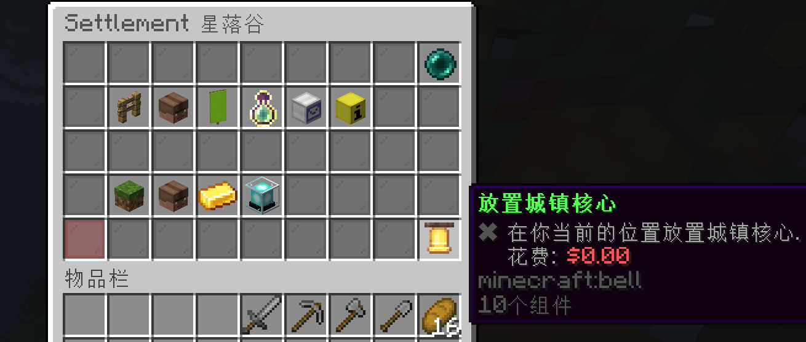

# 领地

领地系统旨在为玩家提供简单易用的领地保护和管理功能。它通过图形用户界面（GUI）让玩家能够轻松管理自己的领地，包括设置权限、环境、信任玩家等。

## 领地类型

领地类型分为 露营地、小镇、国家、荒野。

每位玩家允许拥有1个露营地、2个小镇、1个国家。

## 露营地

露营地用于搭建临时居所, 露营地将在24小时后自动到期并摧毁。
服务器会在每位玩家注册时自动赠送一个露营地创建方块，使用露营地方块在任意荒野右键，即可成功搭建一个露营地。请注意，露营地只作为临时住所，或中转站点，到期露营地建筑被破坏服务器概不负责。

## 小镇

小镇是玩家的通用领地类型，建造家园请先创建小镇，每位玩家最多可以创建或者加入两个小镇。创建和加入小镇的数量是共享的，一共只能有两个。每一个小镇最大可以扩展20个区块。小镇的创建没有任何费用，所以请新玩家在建家之前一定要创建小镇。

| 指令 | 说明 |
|------|------|
| `/lands create 名称` | 创建一个小镇 |
| `/lands claim` | 占领当前区块 |
| `/lands ` | 查看小镇菜单/这个功能可以从菜单进入。小镇菜单内可以配置当前领地的一系列参数，包括管理子区域、管理领地玩家、外交关系、设置传送点、修改领地内的环境、职位设置、管理税务等等。 |
| `/lands map` | 查看小镇地块，可以用来扩展小镇地块 |
| `/lands help` | 更多玩家可用指令，参阅此条 |

## 更多玩法

由于编者水平有限，更多玩法请参考官方原文
https://wiki.incredibleplugins.com/lands/players/