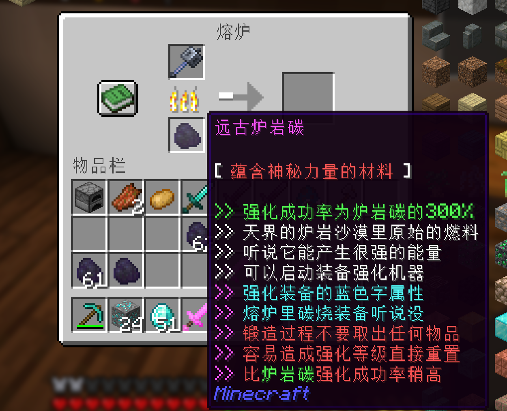

# 装备强化系统指南

## 基础规则

- 最大强化等级：20级
- 强化方式：
  - 熔炉强化
- 强化等级 大于 10 时 会附带粒子特效

## 强化成功率

| 强化等级 | 成功率 |
| -------- | ------ |
| 1 → 2    | 100%   |
| 2 → 3    | 90%    |
| 3 → 4    | 80%    |
| 4 → 5    | 70%    |
| 5 → 6    | 60%    |
| 6 → 7    | 50%    |
| 7 → 8    | 40%    |
| 8 → 9    | 30%    |
| 9 → 10   | 20%    |
| 10 → 11  | 10%    |
| 11 → 12  | 30%    |
| 12 → 13  | 25%    |
| 13 → 14  | 20%    |
| 14 → 15  | 15%    |
| 15 → 16  | 10%    |
| 16 → 17  | 5%     |
| 17 → 18  | 4%     |
| 18 → 19  | 3%     |
| 19 → 20  | 2%     |

## 强化材料获取

### 矿物采集

| 矿物类型      | 掉落概率 |
| ------------- | -------- |
| 金矿/下界金矿 | 1%       |
| 铁矿          | 1%       |
| 钻石/绿宝石矿 | 10%      |
| 煤矿/青金石矿 | 0.1%     |
| 红石/石英矿   | 0.1%     |

### 钓鱼获取

| 鱼类          | 掉落概率 |
| ------------- | -------- |
| 生鳕鱼/三文鱼 | 1%       |
| 热带鱼/河豚   | 1%       |

## 强化失败惩罚

- +8 失败：降至 3-4 级
- +9 失败：降至 2-3 级
- +10 失败：降至 1-2 级
- +11及以上失败：装备直接损毁

## 特殊机制

1. 强化秘药

   - 增加4%成功率（加法计算）
   - 持续30分钟

2. 装备限制

   - 禁止强化词条：包含以下任意Lore的装备不可强化
     - "精英怪物装备"
     - "不能强化"
     - "禁止强化"

3. 区域限制
   - 同一区域（区块）内：
     - 每30分钟最多掉落1个炉岩碳
     - 影响钓鱼掉落

## 可强化装备类型

| 装备类型 | 是否支持 |
| -------- | -------- |
| 护甲     | ✔       |
| 斧       | ✔       |
| 弓       | ✔       |
| 弩       | ✔       |
| 锤       | ✔       |
| 盾       | ✔       |
| 剑       | ✔       |
| 三叉戟   | ✔       |
| 鞘翅     | ✔       |

## 高级属性（+10以上）

| 装备类型 | 增益属性   | 每级加成 |
| -------- | ---------- | -------- |
| 护甲     | 最大生命值 | +1❤️     |
| 斧/剑/戟 | 攻击速度   | +10%     |
| 弓/弩    | 移动速度   | +10%     |
| 盾       | 最大生命值 | +1❤️     |
| 锤       | 攻击速度   | +10%     |
